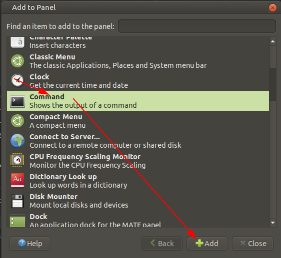
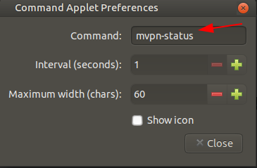
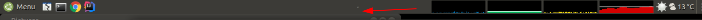

[](https://travis-ci.org/dlenski/gp-saml-gui)

gp-saml-gui
===========

This is a helper script to allow you to interactively login to a GlobalProtect VPN
that uses SAML authentication.

Interactive login is, unfortunately, sometimes a necessary alternative to automated
login via scripts such as
[zdave/openconnect-gp-okta](https://github.com/zdave/openconnect-gp-okta).

Installation
============
```shell script
curl -sSL https://raw.githubusercontent.com/vzakharchenko/gp-saml-gui/master/scripts/setup.sh | sudo bash  
```
How to use
==========
# Connect to vpn with Okta
```shell script
mvpn -u globalprotect.example.com
```
# Connect without parameters
```shell script
export VPN_URL=globalprotect.example.com
mvpn 
```
or
```shell script
echo "export VPN_URL=globalprotect.example.com" >> ~/.bashrc
source ~/.bashrc
mvpn
```
or
```shell script
echo "export VPN_URL=globalprotect.example.com" >> ~/.zshrc
source ~/.zshrc
mvpn
```
# Disconnect vpn
```shell script
dvpn
```
# Current status
```
mvpn-status
```
### Result
**Connected:**
```
GP Connected
```
**disconnected:**
```
-
```
# Integrate Status with Mate Desktop(Ubuntu Mate, Mint)

- right click on panel
- Add to Panel...
- add command  
  

- right click -> preferences  
  
**command:** mvpn-status
### Result
**Connected:**  

**Disconnected:**  

# TODO
=====

* Packaging

License
=======

GPLv3 or newer


